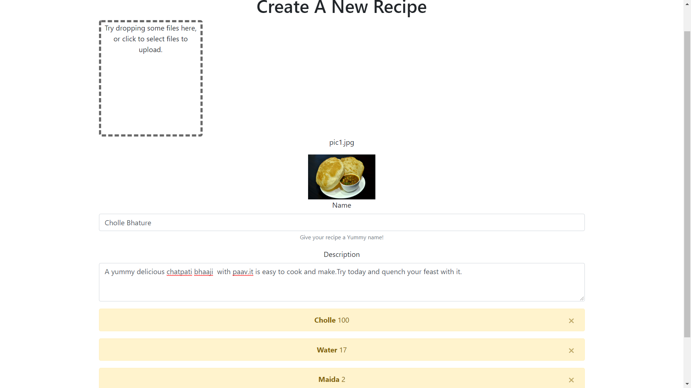
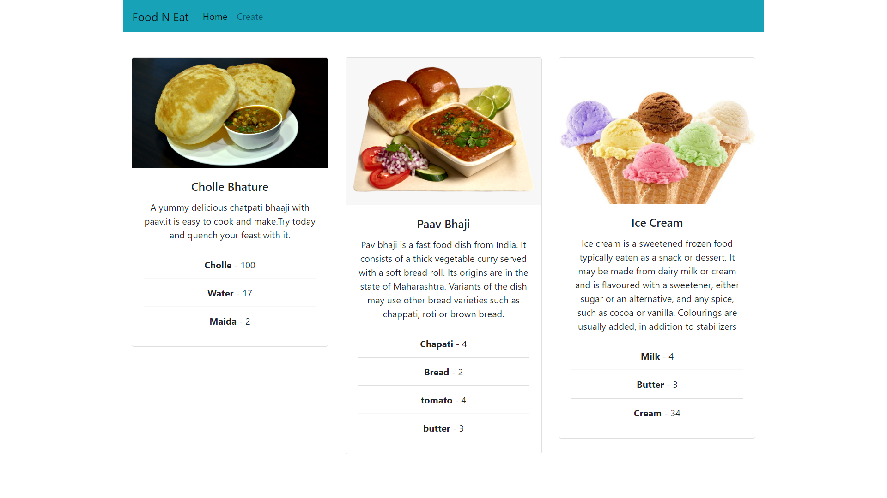

## Fun N Eat (React,with drag n drop) 
this is simple menu app made in react.js with a recipe menu and a recipe create form to add ingredients and a drag and drop to upload a recipe image.

### Technology Used
1:React.js : frontend js framework

2:Bootstap : Css library for front end 

### Notes
for running this app , you have to sign up to cloudinary account and note your preset and upload url to `create.js` file at line 5 & 6

### for screenshots 

  </img>
  </img>
